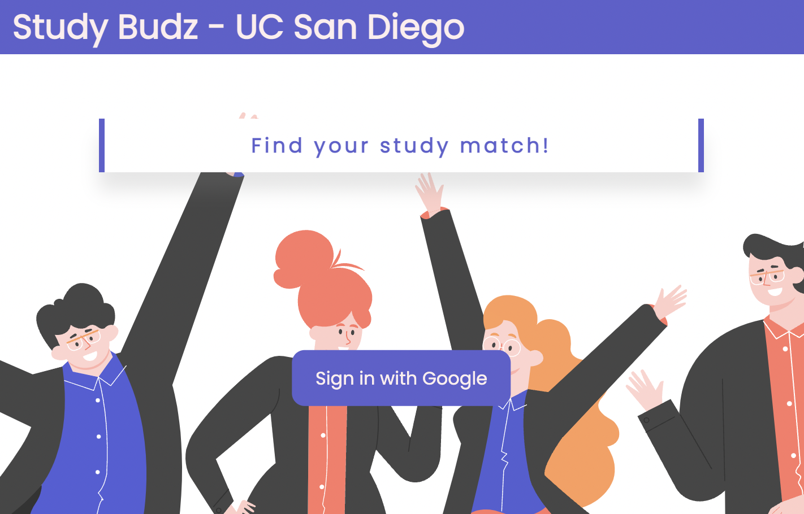
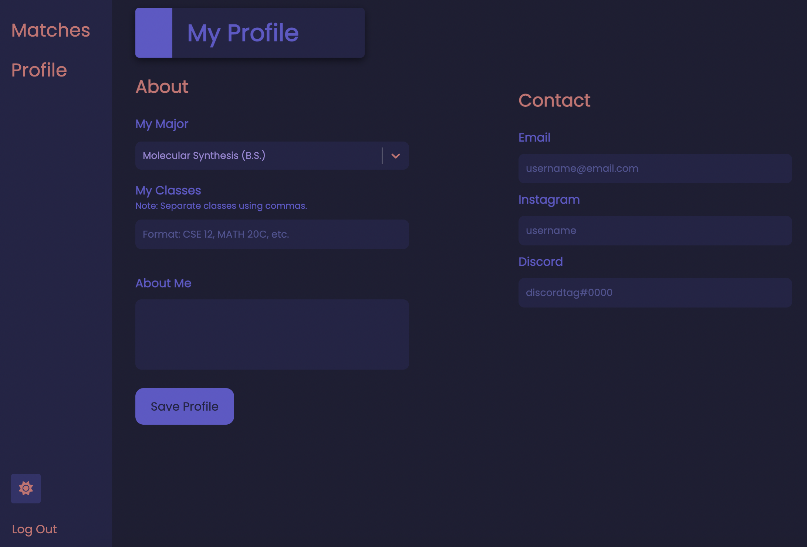
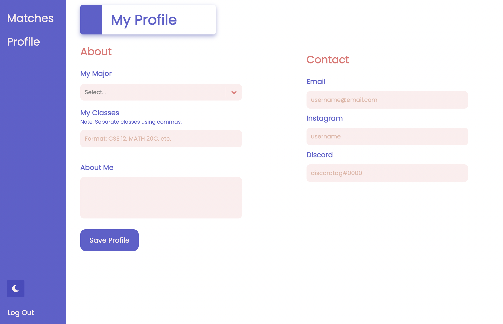
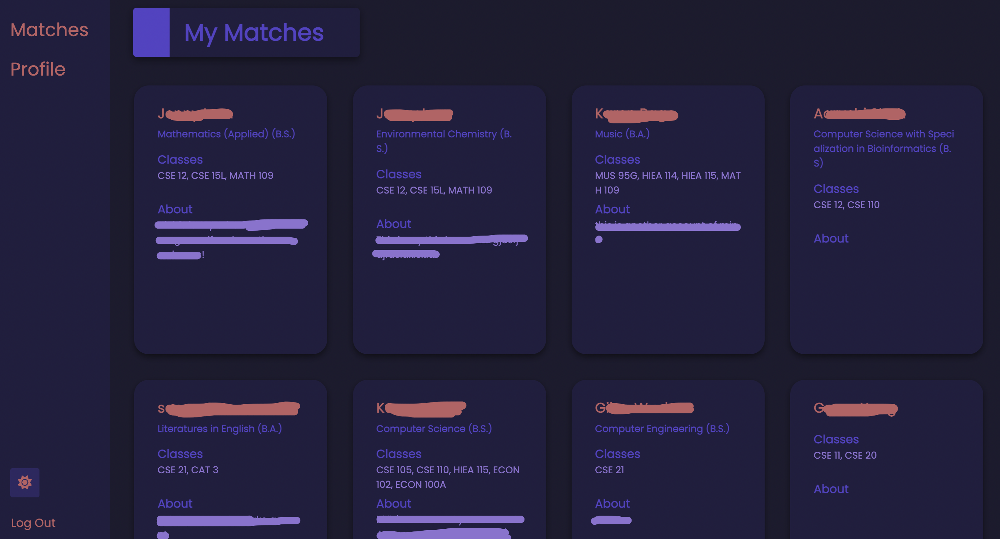

# Study Budz

Study Budz is a web app that connects UCSD students with potential study buddies based on similar classes and major. It is inspired by the fact that many people have a hard time finding study buddies or reaching out to others. This web app aims to match students to study buddies to help them find people to study with and has an emphasis on an academic standpoint rather than a social one.

## Site
### Landing Page

What you see when you open the web app (currently, there's a small bug with the light/dark mode toggle button that affects the landing page and makes it look ugly so if it looks different, that's probably why).

### Profile Page
 

Once logged in, users can update their profile by selecting a major through the dropdown, listing their classes, updating their bio so others can learn about them, and provide some social media handles so other users can reach out to them. There is also a button to toggle between light and dark mode. 

### Matches Page
 

When the user's profile is updated, they will see their matches, students who have classes and/or their major in common. For each user, the rest of the students are ordered by the number of classes they have in common, with an extra "point" bonus if they share the same major. Clicking on a user's name would open up their full profile, where they can read their full bio and view their contact information to connect.

## Demo

Check it out [here](https://studybudz.vercel.app)!

Note: There is not a way to delete your account from the site yet once you sign in with Google. You have been warned.

## Built With
Study Budz was built with React.js and uses Firebase to authorize users and store user data.
